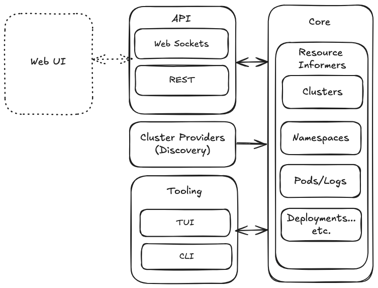

# kube-dashboard

`kube-dashboard` is a Kubernetes dashboard designed to manage multiple Kubernetes clusters, monitor resources, and interact with pods and logs in real-time. It provides a RESTful API and WebSocket endpoints for managing clusters, retrieving pod information, and streaming logs for building tools in the context of consuming and managing Kubernetes Clusters.

## Status

Under development

## Current Architecture

### API (Fiber)

Interface/contract with Web UI or other clients via REST and websockets

### Cluster Providers (Provider Interface)

Handle discovery of Kubernetes clusters

### Core (Kube Informers)

Utilize Informers and caching to maintain and maintain state on changes with in all Kubernetes Clusters (discovert done by Cluster Provider)

### Tooling (TBD)

Provide an TUI (Text UI) and CLI

### Persistence/Hydration (MongoDB)

Potentially, a backing database

## Testing websockets

npx wscat  -c ws://localhost:8081/ws/cluster-1/kube-system/coredns-668d6bf9bc-n7vrd/coredns/logs